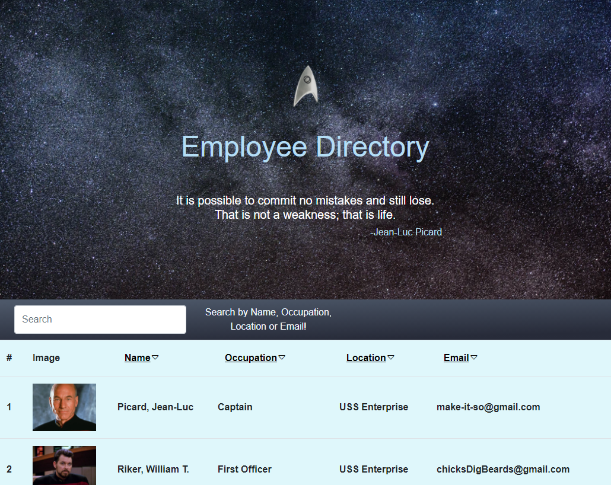

# Employee-Directory

## User Story
* As a user, I want to be able to view my entire employee directory at once so that I have quick access to their information.

## Business Context

An employee or manager would benefit greatly from being able to view non-sensitive data about other employees. It would be particularly helpful to be able to filter employees by name.

## Information
This employee directory uses React to render employee columns in real time as the user enters keystrokes.

Can sort columns alphabetically by clicking header items (Name, Occupation, Location, and Email.)

[Deployed-Heroku-App]("https://star-trek-directory.herokuapp.com/)